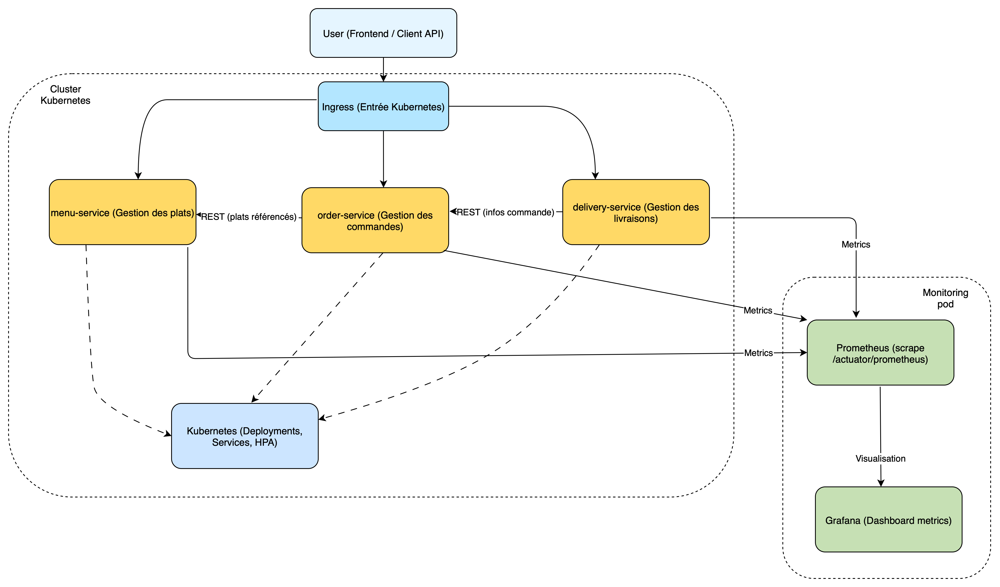
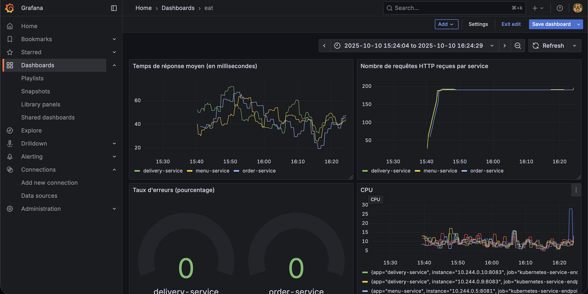
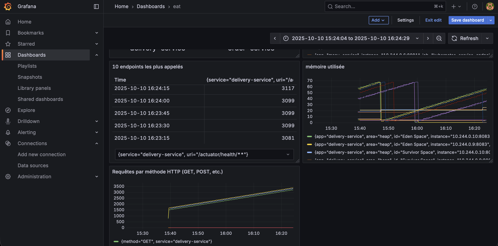

---

# 🍽️ Eat Now - Plateforme de Commande de Repas

> Application de restauration en ligne basée sur une architecture microservices avec Spring Boot, Kubernetes, Prometheus et Grafana.

## 📋 Table des Matières

- [Description du Projet](#-description-du-projet)
- [Architecture](#️-architecture)
- [Livrables](#-livrables)
- [Stack Technique](#️-stack-technique)
- [Structure du Projet](#-structure-du-projet)
- [Instructions de Build et Déploiement](#-instructions-de-build-et-déploiement)
- [URLs d'Accès aux Services](#-urls-daccès-aux-services)
- [Documentation API](#-documentation-api)
- [Dashboard Grafana](#-dashboard-grafana)
- [Résilience](#-résilience)
- [Commandes Utiles](#-commandes-utiles)

---

## 📝 Description du Projet

**Eat Now** est une application de commande de repas en ligne (type Uber Eats) construite avec une architecture microservices. Le projet démontre :

- ✅ **3 microservices Spring Boot autonomes** (menu, order, delivery)
- ✅ **Containerisation Docker** avec multi-stage builds
- ✅ **Orchestration Kubernetes** (Deployments, Services, HPA, Ingress)
- ✅ **Résilience** avec Resilience4j (Circuit Breaker, Retry, Timeout)
- ✅ **Observabilité** avec Prometheus + Grafana
- ✅ **Documentation API** avec Swagger/OpenAPI
- ✅ **Scalabilité** automatique avec HPA

---

## 🏗️ Architecture

L'application est composée de **3 microservices** communiquant via HTTP REST :

### 1. 📖 Menu Service (Port 8081)

**Gestion du catalogue des plats**

**Fonctionnalités :**

- Lister tous les plats
- Consulter le détail d'un plat
- Ajouter/Modifier/Supprimer un plat
- Filtrer par catégorie et disponibilité

**Endpoints principaux :**

```
GET    /api/dishes           # Liste tous les plats
GET    /api/dishes/{id}      # Détail d'un plat
POST   /api/dishes           # Créer un plat
PUT    /api/dishes/{id}      # Modifier un plat
DELETE /api/dishes/{id}      # Supprimer un plat
```

### 2. 🛒 Order Service (Port 8082)

**Gestion des commandes clients**

**Fonctionnalités :**

- Créer une commande (avec validation des plats via menu-service)
- Consulter une commande
- Lister les commandes par utilisateur
- Workflow de statuts : `CREATED → CONFIRMED → PREPARING → READY → IN_DELIVERY → DELIVERED`

**Endpoints principaux :**

```
POST   /api/orders                    # Créer une commande
GET    /api/orders/{id}               # Détail d'une commande
GET    /api/orders/user/{userId}      # Commandes d'un utilisateur
PATCH  /api/orders/{id}/status        # Mettre à jour le statut
```

### 3. 🚚 Delivery Service (Port 8083)

**Gestion des livraisons**

**Fonctionnalités :**

- Créer une livraison associée à une commande
- Assigner un livreur
- Workflow de statuts : `PENDING → ASSIGNED → PICKED_UP → IN_TRANSIT → DELIVERED`
- Suivi de localisation en temps réel

**Endpoints principaux :**

```
POST   /api/deliveries              # Créer une livraison
GET    /api/deliveries/{id}         # Détail d'une livraison
PATCH  /api/deliveries/{id}/assign  # Assigner un livreur
PATCH  /api/deliveries/{id}/status  # Mettre à jour le statut
PATCH  /api/deliveries/{id}/location # Mettre à jour la position
```

---

## 📦 Livrables

### ✅ 1. Trois dossiers de microservices

```
eat-now/
├── menu_service/         # Microservice Menu
├── order_service/        # Microservice Order
└── delivery_service/     # Microservice Delivery
```

Chaque dossier contient :

- Code source Java (Spring Boot 3 + Java 17)
- `pom.xml` (gestion des dépendances Maven)
- Configuration Spring Boot (`application.properties`)
- README spécifique au service

### ✅ 2. Un Dockerfile par service

**Localisation :**

```
menu_service/Dockerfile
order_service/Dockerfile
delivery_service/Dockerfile
```

**Caractéristiques :**

- ✅ Multi-stage build (Maven builder + JRE runtime)
- ✅ Image optimisée (eclipse-temurin:17-jre)
- ✅ Utilisateur non-root pour la sécurité
- ✅ Health checks configurés
- ✅ Variables d'environnement paramétrables

**Images Docker Hub :**

```bash
docker.io/antocreadev2/menu-service:latest
docker.io/antocreadev2/order-service:latest
docker.io/antocreadev2/delivery-service:latest
```

### ✅ 3. Les manifests Kubernetes

**Localisation :** `k8s/`

```
k8s/
├── namespace.yaml              # Namespace "eat-now"
├── menu-service.yaml           # Deployment + Service + HPA
├── order-service.yaml          # Deployment + Service + HPA
├── delivery-service.yaml       # Deployment + Service + HPA
└── ingress.yaml                # Point d'entrée unique
```

**Configuration Kubernetes :**

- **Namespace** : `eat-now` (isolation des ressources)
- **Deployments** : 2 replicas par service avec rolling updates
- **Services** : ClusterIP pour communication interne
- **HPA** : Auto-scaling basé sur CPU (70%) et Memory (80%)
- **Probes** : Liveness et Readiness sur `/actuator/health`
- **Resources** : Requests (512Mi/250m) et Limits (1Gi/500m)
- **Ingress** : Nginx avec host `eat-now.local` et routes par service

### ✅ 4. Le fichier d'architecture Draw.io

**Fichiers :**

- `Diagramme_eatnow_anthonycarre.drawio` (fichier source éditable)
- `diagramme.png` (export PNG pour affichage)

**Contenu du diagramme :**

- Architecture des 3 microservices
- Communication HTTP REST inter-services
- Déploiement Kubernetes (Pods, Services, Ingress)
- Stack monitoring (Prometheus + Grafana)
- Flux de données entre composants

### ✅ 5. Le README.md (ce fichier)

**Contenu :**

- ✅ Instructions complètes de build et déploiement
- ✅ URLs d'accès à tous les services
- ✅ Liens vers la documentation API (Swagger)
- ✅ Captures d'écran du dashboard Grafana
- ✅ Guide d'utilisation et commandes utiles

---

## 🛠️ Stack Technique

| Composant              | Technologie           | Version |
| ---------------------- | --------------------- | ------- |
| **Langage**            | Java                  | 17      |
| **Framework**          | Spring Boot           | 3.5.6   |
| **Build Tool**         | Maven                 | 3.9+    |
| **Containerisation**   | Docker                | Latest  |
| **Orchestration**      | Kubernetes (Kind)     | 1.27+   |
| **Package Manager**    | Helm                  | 3.0+    |
| **Résilience**         | Resilience4j          | 2.x     |
| **Métriques**          | Micrometer + Actuator | Intégré |
| **Monitoring**         | Prometheus            | 2.x     |
| **Visualisation**      | Grafana               | 10.x    |
| **Documentation API**  | Springdoc OpenAPI     | 2.7.0   |
| **Ingress Controller** | Nginx                 | Latest  |

---

## 📁 Structure du Projet

```
eat-now/
│
├── menu_service/                    # ✅ Livrable 1.1 - Microservice Menu
│   ├── src/
│   │   └── main/
│   │       ├── java/anthony/com/menu_service/
│   │       │   ├── controller/      # REST Controllers
│   │       │   ├── service/         # Business Logic
│   │       │   ├── model/           # Entities
│   │       │   ├── dto/             # DTOs
│   │       │   ├── repository/      # In-Memory Storage
│   │       │   └── MenuServiceApplication.java
│   │       └── resources/
│   │           └── application.properties
│   ├── pom.xml
│   ├── Dockerfile                   # ✅ Livrable 2.1 - Dockerfile Menu
│   ├── .dockerignore
│   └── README.md
│
├── order_service/                   # ✅ Livrable 1.2 - Microservice Order
│   ├── src/
│   │   └── main/
│   │       ├── java/anthony1/com/order_service/
│   │       │   ├── controller/
│   │       │   ├── service/
│   │       │   ├── model/
│   │       │   ├── dto/
│   │       │   ├── repository/
│   │       │   ├── client/          # WebClient pour menu-service
│   │       │   └── OrderServiceApplication.java
│   │       └── resources/
│   │           └── application.properties
│   ├── pom.xml
│   ├── Dockerfile                   # ✅ Livrable 2.2 - Dockerfile Order
│   ├── .dockerignore
│   └── README.md
│
├── delivery_service/                # ✅ Livrable 1.3 - Microservice Delivery
│   ├── src/
│   │   └── main/
│   │       ├── java/anthony2/com/delivery_service/
│   │       │   ├── controller/
│   │       │   ├── service/
│   │       │   ├── model/
│   │       │   ├── dto/
│   │       │   ├── repository/
│   │       │   ├── client/          # WebClient pour order-service
│   │       │   └── DeliveryServiceApplication.java
│   │       └── resources/
│   │           └── application.properties
│   ├── pom.xml
│   ├── Dockerfile                   # ✅ Livrable 2.3 - Dockerfile Delivery
│   ├── .dockerignore
│   └── README.md
│
├── k8s/                             # ✅ Livrable 3 - Manifests Kubernetes
│   ├── namespace.yaml               # Namespace "eat-now"
│   ├── menu-service.yaml            # Deployment + Service + HPA
│   ├── order-service.yaml           # Deployment + Service + HPA
│   ├── delivery-service.yaml        # Deployment + Service + HPA
│   └── ingress.yaml                 # Nginx Ingress
│
├── monitoring/                      # Documentation monitoring
│   ├── MONITORING_GUIDE.md
│   └── PROMQL_QUERIES.md
│
├── Diagramme_eatnow_anthonycarre.drawio  # ✅ Livrable 4.1 - Draw.io source
├── diagramme.png                    # ✅ Livrable 4.2 - Diagramme PNG
├── screenshot_1.png                 # ✅ Livrable 5.4 - Capture Grafana 1
├── screenshot_2.png                 # ✅ Livrable 5.4 - Capture Grafana 2
├── README.md                        # ✅ Livrable 5 - Ce fichier
└── .github/
    └── copilot-instructions.md      # Instructions du projet
```

---

## 🚀 Instructions de Build et Déploiement

### Prérequis

Installer les outils suivants :

```bash
# Java 17+
java -version

# Maven 3.9+
mvn -version

# Docker Desktop
docker --version

# Kind (Kubernetes in Docker)
kind --version

# kubectl
kubectl version --client

# Helm 3+
helm version
```

---

### Étape 1 : Cloner le Projet

```bash
git clone <repository-url>
cd eat-now
```

---

### Étape 2 : Build des Images Docker

#### Option A : Pull depuis Docker Hub (recommandé)

```bash
docker pull antocreadev2/menu-service:latest
docker pull antocreadev2/order-service:latest
docker pull antocreadev2/delivery-service:latest
```

#### Option B : Build local

```bash
# Menu Service
cd menu_service
mvn clean package -DskipTests
docker build -t antocreadev2/menu-service:latest .

# Order Service
cd ../order_service
mvn clean package -DskipTests
docker build -t antocreadev2/order-service:latest .

# Delivery Service
cd ../delivery_service
mvn clean package -DskipTests
docker build -t antocreadev2/delivery-service:latest .

cd ..
```

---

### Étape 3 : Créer le Cluster Kubernetes

```bash
# Créer un cluster Kind
kind create cluster --name eat-now-cluster

# Vérifier la connexion
kubectl cluster-info --context kind-eat-now-cluster
```

---

### Étape 4 : Déployer les Microservices

```bash
# Créer le namespace
kubectl apply -f k8s/namespace.yaml

# Déployer les 3 services
kubectl apply -f k8s/menu-service.yaml
kubectl apply -f k8s/order-service.yaml
kubectl apply -f k8s/delivery-service.yaml

# Vérifier les pods (attendre qu'ils soient Running)
kubectl get pods -n eat-now -w
```

**Résultat attendu :**

```
NAME                               READY   STATUS    RESTARTS   AGE
menu-service-xxxxx                 1/1     Running   0          30s
menu-service-yyyyy                 1/1     Running   0          30s
order-service-xxxxx                1/1     Running   0          30s
order-service-yyyyy                1/1     Running   0          30s
delivery-service-xxxxx             1/1     Running   0          30s
delivery-service-yyyyy             1/1     Running   0          30s
```

---

### Étape 5 : Installer l'Ingress Controller

```bash
# Installer Nginx Ingress pour Kind
kubectl apply -f https://raw.githubusercontent.com/kubernetes/ingress-nginx/main/deploy/static/provider/kind/deploy.yaml

# Attendre que le controller soit prêt
kubectl wait --namespace ingress-nginx \
  --for=condition=ready pod \
  --selector=app.kubernetes.io/component=controller \
  --timeout=90s
```

---

### Étape 6 : Déployer l'Ingress

```bash
# Déployer l'Ingress
kubectl apply -f k8s/ingress.yaml

# Configurer /etc/hosts
echo "127.0.0.1 eat-now.local" | sudo tee -a /etc/hosts

# Vérifier l'Ingress
kubectl get ingress -n eat-now
```

---

### Étape 7 : Installer Prometheus et Grafana

```bash
# Ajouter les repositories Helm
helm repo add prometheus-community https://prometheus-community.github.io/helm-charts
helm repo add grafana https://grafana.github.io/helm-charts
helm repo update

# Installer Prometheus
helm install prometheus prometheus-community/prometheus \
  --namespace eat-now \
  --set server.service.type=NodePort \
  --set server.service.nodePort=30090

# Installer Grafana
helm install grafana grafana/grafana \
  --namespace eat-now \
  --set service.type=NodePort \
  --set service.nodePort=30300 \
  --set adminPassword=admin123

# Vérifier que Prometheus et Grafana sont démarrés
kubectl get pods -n eat-now | grep -E "prometheus|grafana"
```

---

### Étape 8 : Vérification Complète

```bash
# Vérifier tous les pods
kubectl get pods -n eat-now

# Vérifier tous les services
kubectl get svc -n eat-now

# Vérifier les HPA
kubectl get hpa -n eat-now

# Vérifier l'Ingress
kubectl get ingress -n eat-now
```

---

## 🌐 URLs d'Accès aux Services

### Services via Ingress (Port 80)

| Service              | URL                                          | Description                   |
| -------------------- | -------------------------------------------- | ----------------------------- |
| **Menu Service**     | http://eat-now.local/menu/api/dishes         | API du catalogue des plats    |
| **Order Service**    | http://eat-now.local/order/api/orders        | API de gestion des commandes  |
| **Delivery Service** | http://eat-now.local/delivery/api/deliveries | API de gestion des livraisons |

### Monitoring

Pour accéder à Prometheus et Grafana, faire des **port-forwards** :

```bash
# Prometheus
kubectl port-forward -n eat-now svc/prometheus-server 9090:80

# Grafana
kubectl port-forward -n eat-now svc/grafana 3000:80
```

| Outil          | URL                   | Identifiants     |
| -------------- | --------------------- | ---------------- |
| **Prometheus** | http://localhost:9090 | -                |
| **Grafana**    | http://localhost:3000 | admin / admin123 |

---

## 📚 Documentation API

### Swagger UI (Interface Interactive)

Chaque microservice expose une interface Swagger pour tester les APIs :

| Service              | Swagger UI                                          | OpenAPI JSON                              |
| -------------------- | --------------------------------------------------- | ----------------------------------------- |
| **Menu Service**     | http://eat-now.local/menu/swagger-ui/index.html     | http://eat-now.local/menu/v3/api-docs     |
| **Order Service**    | http://eat-now.local/order/swagger-ui/index.html    | http://eat-now.local/order/v3/api-docs    |
| **Delivery Service** | http://eat-now.local/delivery/swagger-ui/index.html | http://eat-now.local/delivery/v3/api-docs |

### Exemples d'utilisation

#### 1. Créer un plat (Menu Service)

```bash
curl -X POST http://eat-now.local/menu/api/dishes \
  -H "Content-Type: application/json" \
  -d '{
    "name": "Pizza Margherita",
    "description": "Pizza italienne classique",
    "price": 12.50,
    "category": "MAIN_COURSE",
    "available": true,
    "imageUrl": "https://example.com/pizza.jpg"
  }'
```

#### 2. Créer une commande (Order Service)

```bash
curl -X POST http://eat-now.local/order/api/orders \
  -H "Content-Type: application/json" \
  -d '{
    "userId": "user123",
    "items": [
      {"dishId": 1, "quantity": 2}
    ],
    "deliveryAddress": "123 Rue de Paris, 75001 Paris"
  }'
```

#### 3. Créer une livraison (Delivery Service)

```bash
curl -X POST http://eat-now.local/delivery/api/deliveries \
  -H "Content-Type: application/json" \
  -d '{
    "orderId": 1,
    "pickupAddress": "Restaurant Le Gourmet, 45 Rue de la Paix",
    "deliveryAddress": "123 Rue de Paris, 75001 Paris"
  }'
```

#### 4. Assigner un livreur

```bash
curl -X PATCH http://eat-now.local/delivery/api/deliveries/1/assign \
  -H "Content-Type: application/json" \
  -d '{
    "driverId": "driver456",
    "driverName": "Jean Dupont",
    "driverPhone": "+33612345678"
  }'
```

---

## 📊 Dashboard Grafana

### Accès au Dashboard

1. **Ouvrir Grafana** : http://localhost:3000 (après port-forward)
2. **Se connecter** : admin / admin123
3. **Dashboard** : "Eat Now - Microservices Monitoring"

### Captures d'Écran

**Dashboard Principal :**


**Détails des Métriques :**


### Métriques Affichées

Le dashboard Grafana affiche les métriques clés suivantes :

#### 1️⃣ **Services Status** (UP/DOWN)

```promql
up{namespace="eat-now",service=~"menu-service|order-service|delivery-service"}
```

- Affiche l'état de santé de chaque service (1 = UP, 0 = DOWN)
- **6 pods** au total (2 replicas × 3 services)

#### 2️⃣ **Nombre de Requêtes HTTP par Service**

```promql
sum(increase(http_server_requests_seconds_count{namespace="eat-now"}[5m])) by (service)
```

- Compteur de requêtes HTTP sur les 5 dernières minutes
- Graphique par service (menu, order, delivery)

#### 3️⃣ **Taux d'Erreurs (%)**

```promql
(sum(increase(http_server_requests_seconds_count{namespace="eat-now",status=~"4..|5.."}[5m])) by (service) / sum(increase(http_server_requests_seconds_count{namespace="eat-now"}[5m])) by (service)) * 100
```

- Pourcentage d'erreurs HTTP (4xx et 5xx)
- Seuils : Vert (<5%), Orange (5-10%), Rouge (>10%)

#### 4️⃣ **Temps de Réponse Moyen (ms)**

```promql
(sum(increase(http_server_requests_seconds_sum{namespace="eat-now"}[5m])) by (service) / sum(increase(http_server_requests_seconds_count{namespace="eat-now"}[5m])) by (service)) * 1000
```

- Temps de réponse moyen par service en millisecondes

#### 5️⃣ **Utilisation CPU (%)**

```promql
process_cpu_usage{namespace="eat-now"} * 100
```

- Pourcentage d'utilisation CPU par pod

#### 6️⃣ **Mémoire Heap Utilisée (MB)**

```promql
jvm_memory_used_bytes{namespace="eat-now",area="heap"} / 1048576
```

- Consommation mémoire heap de la JVM en MB

#### 7️⃣ **Threads Actifs**

```promql
jvm_threads_live_threads{namespace="eat-now"}
```

- Nombre de threads actifs dans chaque pod

### Prometheus Targets

Tous les services sont scrapés par Prometheus :

```
kubernetes-service-endpoints (9 targets UP) :
- menu-service:8081 (2 pods)         ✅
- order-service:8082 (2 pods)        ✅
- delivery-service:8083 (2 pods)     ✅
- prometheus-kube-state-metrics      ✅
- coredns (2 pods)                   ✅
```

**Vérifier dans Prometheus** : http://localhost:9090/targets

---

## 🔄 Résilience

Tous les appels inter-services sont protégés avec **Resilience4j** :

### Circuit Breaker

```yaml
failureRateThreshold: 50 # Ouvre le circuit si 50% d'échecs
waitDurationInOpenState: 10000 # Attend 10s avant de réessayer
permittedNumberOfCallsInHalfOpenState: 3
```

### Retry

```yaml
maxAttempts: 3 # 3 tentatives maximum
waitDuration: 1000 # 1s entre chaque tentative
```

### Timeout

```yaml
timeoutDuration: 2000 # 2 secondes maximum par requête
```

### Exemple de Fallback

Si le `menu-service` est indisponible lors d'une création de commande :

```json
{
  "id": 1,
  "userId": "user123",
  "items": [
    {
      "dishId": 1,
      "quantity": 2,
      "dishName": "Service temporairement indisponible",
      "unitPrice": 0.0
    }
  ],
  "totalAmount": 0.0,
  "status": "CREATED"
}
```

---

## 🔧 Commandes Utiles

### Kubernetes

```bash
# Voir tous les pods
kubectl get pods -n eat-now

# Voir les logs d'un service
kubectl logs -n eat-now -l app=menu-service -f

# Voir les services
kubectl get svc -n eat-now

# Voir l'Ingress
kubectl get ingress -n eat-now

# Voir les HPA
kubectl get hpa -n eat-now

# Describe un pod
kubectl describe pod -n eat-now <pod-name>

# Exec dans un pod
kubectl exec -it -n eat-now <pod-name> -- /bin/sh

# Redémarrer un deployment
kubectl rollout restart deployment/menu-service -n eat-now
```

### Monitoring

```bash
# Port-forward Prometheus
kubectl port-forward -n eat-now svc/prometheus-server 9090:80

# Port-forward Grafana
kubectl port-forward -n eat-now svc/grafana 3000:80

# Voir les métriques brutes d'un pod
kubectl port-forward -n eat-now <pod-name> 8081:8081
curl http://localhost:8081/actuator/prometheus
```

### Tests API

```bash
# Lister les plats
curl http://eat-now.local/menu/api/dishes

# Créer une commande
curl -X POST http://eat-now.local/order/api/orders \
  -H "Content-Type: application/json" \
  -d '{"userId":"user123","items":[{"dishId":1,"quantity":2}],"deliveryAddress":"123 Rue de Paris"}'

# Consulter une commande
curl http://eat-now.local/order/api/orders/1
```

### Nettoyage

```bash
# Supprimer tout le namespace (supprime tous les services)
kubectl delete namespace eat-now

# Supprimer le cluster Kind
kind delete cluster --name eat-now-cluster

# Nettoyer /etc/hosts
sudo sed -i '' '/eat-now.local/d' /etc/hosts
```


---

## 🎯 Points Clés du Projet

### ✅ Respect du Cahier des Charges

| Exigence                        | Implémentation                                | Statut |
| ------------------------------- | --------------------------------------------- | ------ |
| **3 microservices Spring Boot** | menu_service, order_service, delivery_service | ✅     |
| **Java 17 + Spring Boot 3**     | Java 17, Spring Boot 3.5.6                    | ✅     |
| **Maven**                       | Gestion des dépendances                       | ✅     |
| **Communication REST**          | WebClient avec Resilience4j                   | ✅     |
| **Résilience**                  | Circuit Breaker + Retry + Timeout             | ✅     |
| **Observabilité**               | Micrometer + Actuator + Prometheus            | ✅     |
| **Documentation API**           | Swagger/OpenAPI                               | ✅     |
| **Stockage en mémoire**         | List/Map (pas de DB externe)                  | ✅     |
| **Dockerfiles**                 | Multi-stage builds optimisés                  | ✅     |
| **Kubernetes**                  | Deployments + Services + HPA                  | ✅     |
| **Probes**                      | Liveness + Readiness                          | ✅     |
| **Ingress**                     | Point d'entrée unique (Nginx)                 | ✅     |
| **Prometheus**                  | Collecte des métriques                        | ✅     |
| **Grafana**                     | Dashboard avec métriques clés                 | ✅     |
| **Draw.io**                     | Diagramme d'architecture                      | ✅     |
| **README**                      | Documentation complète                        | ✅     |

### 🏆 Bonnes Pratiques Implémentées

- ✅ **Architecture microservices** découplée et scalable
- ✅ **Images Docker sécurisées** (utilisateur non-root)
- ✅ **Resources Kubernetes** (requests/limits définis)
- ✅ **Health checks** (liveness/readiness probes)
- ✅ **Rolling updates** sans downtime
- ✅ **Auto-scaling** (HPA sur CPU et Memory)
- ✅ **Résilience** avec fallbacks
- ✅ **Métriques exhaustives** (HTTP, JVM, CPU, Memory)
- ✅ **Documentation API** interactive (Swagger)
- ✅ **Monitoring temps réel** (Prometheus + Grafana)

---

## 👨‍💻 Auteur

**Anthony Marchiselli**

- LinkedIn: [Anthony Marchiselli](https://www.linkedin.com/in/anthony-marchiselli-4ab83a347/)
  
- GitHub: [@antocreadev](https://github.com/Anthony2a) 

**Anthony Menghi**

- LinkedIn: [Anthony Menghi](https://www.linkedin.com/in/anthony-menghi/)

- GitHub: [@antocreadev](https://github.com/antocreadev)

- Docker Hub: [antocreadev2](https://hub.docker.com/u/antocreadev2)

---

## 📝 Licence

Ce projet est réalisé dans un cadre éducatif pour démontrer les compétences en :

- Architecture microservices
- Spring Boot & Java
- Docker & Kubernetes
- Observabilité & Monitoring
- DevOps & Cloud Native

---

## 🔗 Ressources

- [Spring Boot Documentation](https://spring.io/projects/spring-boot)
- [Kubernetes Documentation](https://kubernetes.io/docs/)
- [Prometheus Documentation](https://prometheus.io/docs/)
- [Grafana Documentation](https://grafana.com/docs/)
- [Resilience4j Documentation](https://resilience4j.readme.io/)
- [Helm Documentation](https://helm.sh/docs/)
- [Springdoc OpenAPI](https://springdoc.org/)

---

**🎉 Merci d'avoir consulté le projet Eat Now !**
